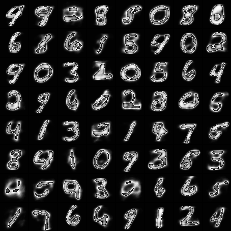

# VAE（变分自编码器）
使用Numpy实现VAE模型，并在MNIST数据集上进行样本生成。

## 主要思路
VAE主要优化的是从正太分布中生成的数据与真实数据的损失（二分交叉熵损失或者均方差损失）以及预测分布与真实分布之间的损失（KL散度），模型需要自动训练并权衡这两方面的损失。

## 实验过程
尝试在隐藏层使用tanh作为损失函数但是由于指数运算经常发生溢出导致梯度爆炸，所以该为采用relu系激活函数，由于训练时间较长，只在5000个样本上进行训练了100轮，生成的样本结果如下。

## 实验结果
相比于GAN，VAE的效果可能并没有那么出彩，但是VAE是概率图模型与深度模型的一次大胆尝试，具有很大的意义。
生成的最终图片如下。

